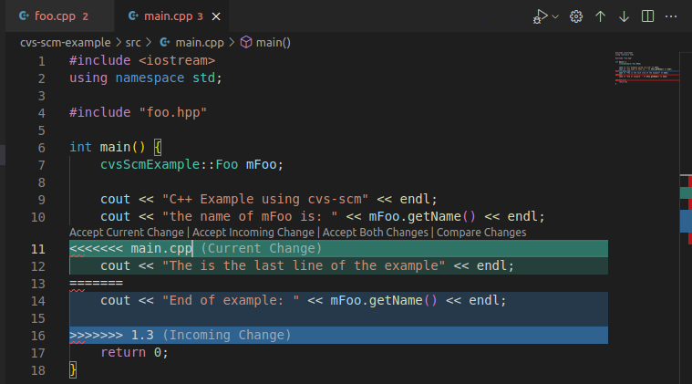
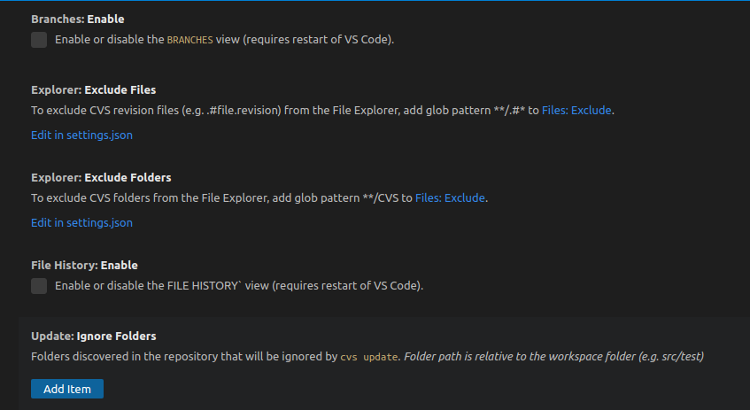
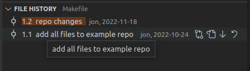
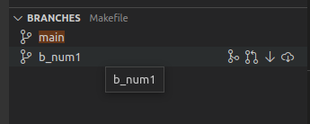
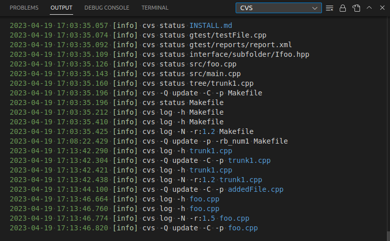

# CVS for Visual Studio Code

The extension provides CVS (Concurrent Versions System) support to VS Code. CVS is an older Source Control Management (SCM) system. The extension integrates CVS into VS Code's SCM interface for a familiar user experience such as git.

## Pre-requisites
- CVS client software is [installed](https://www.nongnu.org/cvs/).
- For remote CVS servers (pserver & ext) ensure the CVS client can login/connect successfully before using the extension. Future versions of the extension will attempt to detect and warn when the CVS server cannot be accessed.
- The root of workspace folders must contain a `CVS` folder. The extension will ignore workspace folders (including sub-folders) that do not contain a `CVS` folder directly under the root of an added/imported workspace folder.

## Features

The extension will automatically activate when it detects source code managed by CVS. It provides the following features:
- Add new file or folder to the repository:
- Remove file from repository:
- Commit changes to the repository:
- Merge changes from the repository into local copy
- Discard local changes and revert to the repository revision.
- View diffs between locally modified file and repository revision.
- Display branch and revision number of file opened in active editor.

## Source Control States

The following describes the possible states for a source control resource:

- `M  (Staged Changes/Changes) Locally Modified`
- `A  (Staged Changes/Changes) Locally Added`
- `R  (Staged Changes/Changes) Locally Removed`
- `D  (Changes) Locally Deleted`
- `R  (Repository Changes) Removed from repository`
- `F  (Repository Changes) Folder found in repository`
- `M  (Repository Changes) Needs Merge with repository`
- `NC (Conflicts) Needs Checkout from repository`
- `P  (Repository Changes) Needs Patch from repository`
- `C  (Conflicts) File had conflicts on merge`
- `U  (Untracked) Resource is not part of source control`

### Staged Changes

Changes to be included in a commit must be staged. However, unlike git, additional changes made to a staged item will not display under `Changes`. Think of `Staged Changes` as a collection of changed source control items that are selected for the next commit.
### Repository Changes

To check for remote changes use the `Refresh Repository` icon. Remote changes detected by the extension are displayed here.
 
### Conflicts

Changes that require user intervention to solve merge conflicts are listed in `Conflicts`.

## Branch and Revision

The Branch (Sticky Tag) and Revision are displayed for the file opened in the active editor.

## Quick Diff

Both the regular diff (when the user clicks on the changed resource in the source control view) and the Quick Diff (available in the left margin of the text editor) are provided by the extension. 

## Extension Settings

### File History

The File History tree view is `defaulted to disabled` (off). The view displays the revisions, for the current branch, assocaited with the file in the active editor. 

The view is designed with the expectation that the CVS repository has managed all cvs revison numbers for trunk (1.1, 1.2, 1.3, ...) and branches (1.3.2.1, 1.3.2.2, ...). If the cvs revision numbers have been manualy manipulated (e.g. `cvs commit -r 3.0`) the view will have undefined behaviour.

The view provides the following commands:
 - Compare the working revision with an older revision.
 - Switch a file to a previous revision.
 - Compare changes between contiguous revisions.
 - Revert a file's contents with a a older revision.

### Branches

The Branches tree view is `defaulted to disabled` (off). The view displays the branches associated with the file in the active editor. 

The view provides the following commands:
 - Compare the file in the active editor with a branch.
 - Switch the workspace to a branch.
 - Switch a file to a branch.
 - Merge the workspace with a branch.
 - Merge a file with a branch.

### Logging

The extension provides a log OUTPUT channel called `CVS` where the cvs client interactions can be viewed.

## Supported CVS Version

The extension was developed using version 1.12.13-MirDebian-28 (client/server) of CVS. Older versions may not be compatible with the extension.

## Known Issues

- The extension has been tested with Ubuntu 16.04 & 22.04 LTS. Issues encountered with Windows or macOS may not be resolved in a timely fashion.
