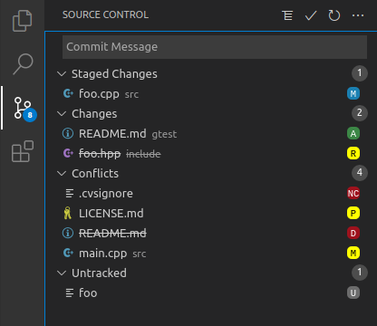
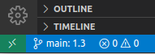
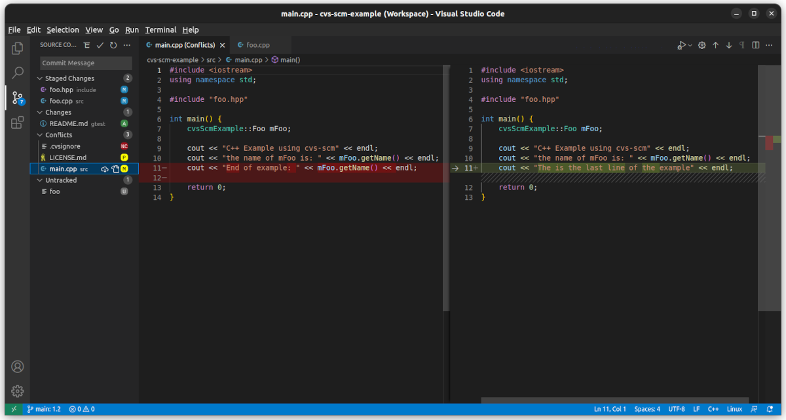
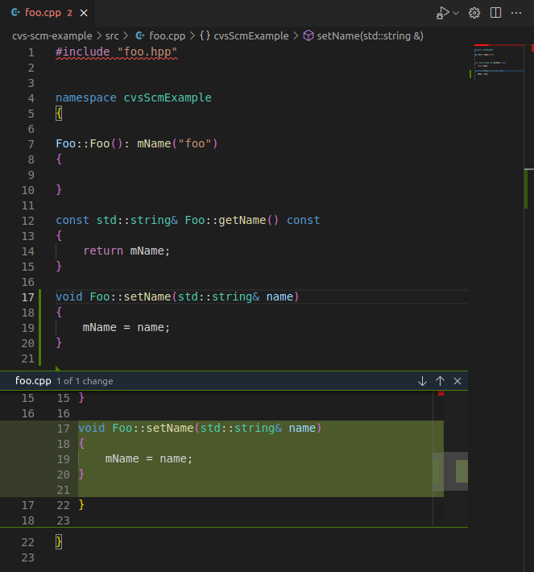

# CVS for Visual Studio Code

The extension provides CVS (Concurrent Versions System) support to VS Code. CVS is an older Source Control Management (SCM) system. The extension integrates CVS into VS Code's SCM interface for a familar user experience such as git.

## Features

The extenstioin will automatically activate when it detects source code managed by CVS. It provides the following features:
- Add files.
- Remove files
- Undo add or remove of file.
- Revert files to the repository version.
- Commit files.
- Merge changes from the repository into local copy.
- View diffs between locally modifed file and repository version.
- Display branch and revision number of file opened in active editor.
## Source Control States

The following describes the possible states for a source control resource:

- `M  (Staged Changes/Changes) Locally Modifed`
- `A  (Staged Changes/Changes) Locally Added`
- `R  (Staged Changes/Changes) Locally Removed`
- `NC (Conflicts) Needs Checkout`
- `P  (Conflicts) Needs Patch`
- `D  (Conflicts) Locally Deleted`
- `M  (Conflicts) Needs Merge`
- `U  (Untracked) Unknown`

### Conflicts

Remote changes detected by the extension are displayed here. User intervention may be required to solve merge conflicts. To check for remote changes use the `Refresh Repository` icon.

## Branch and Revision

The Branch (Sticky Tag) and Revision are displayed for the file opened in the active editor.

## Quick Diff

Both the regular diff (when the user clicks on the changed resource in the source control view) and the Quick Diff (available in the left margin of the text editor) are provided by the extension. 

## Pre-requisites
CVS client software is [installed](https://www.nongnu.org/cvs/).

## Supported CVS Version

The extension was developed using version 1.12.13-MirDebian-28 (client/server) of CVS. Older versions may not be compatible with the extension.

## Extension Settings

None at this time.

## Known Issues

- `The extension has only been tested with Ubuntu 16.04 & 22.04 LTS. Issues encountered with Windows or macOS may not be resolved in a timely fashion.`
- `New folders remotly added to the repository (e.g. another developer) will not be detected by the extension. Use the cvs command line interface to checkout the folders.`
